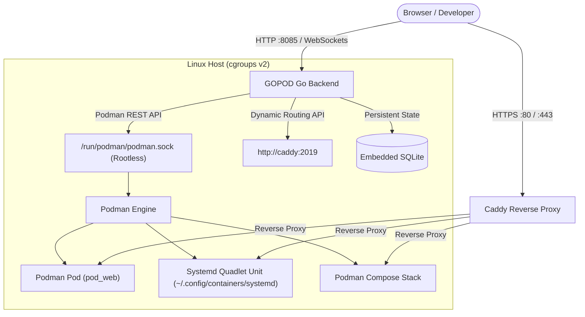

# GOPOD 🚀

> **The Modern, Daemonless, Podman-Native Platform-as-a-Service (PaaS).**  
> Lightweight, secure by design, and built natively for Linux cgroups v2, Podman rootless sockets, Quadlet systemd units, and Caddy ingress.

[](LICENSE)
[](https://podman.io)
[](https://go.dev)
[](https://svelte.dev)
[](https://caddyserver.com)

---

## ✨ Why GOPOD?

Most self-hosted PaaS solutions (such as Coolify or Dokploy) rely strictly on the rootful Docker daemon (`/var/run/docker.sock`), bringing along daemon SPOFs (single point of failure) and security concerns.

**GOPOD** was built from the ground up to leverage the modern Linux container ecosystem:
- **Rootless by Default**: Interacts directly with rootless Podman user sockets (`/run/user/$UID/podman/podman.sock`). No root daemon privileges required.
- **First-Class Podman Pods**: Group related containers into real Podman pods sharing network namespaces and localhost loopbacks.
- **Native Systemd Quadlet**: Deploy declarative `.container` and `.pod` units managed directly by `systemd --user` for rock-solid service supervision and auto-restart on host boot.
- **Zero-Touch Ingress with Caddy**: Dynamic Let's Encrypt TLS certificates, automated reverse proxying on `gopod-net`, and WebSocket passthrough without manual Nginx reloads.
- **Multi-Workload Parity**: Full support for Container Images, Git repositories (Dockerfile), Docker Compose, Kubernetes manifests (`podman kube play`), and Systemd Quadlets.
- **Clean & Modular Architecture**: Lightweight Go backend with embedded SQLite (`modernc.org/sqlite`) and a high-performance SvelteKit 5 interface.

---

## 🏛️ Architecture



---

## ⚡ Features

| Feature | Description |
|---|---|
| **Rootless Podman Native** | Direct integration with `libpod` REST API via user socket; zero daemon overhead. |
| **Systemd Quadlet Supervised** | Generates native systemd service units for containers with systemd reliability. |
| **Podman Pods** | Co-locate microservices and databases inside shared network pods (`localhost:port`). |
| **Caddy 2 Dynamic Ingress** | Automatic Let's Encrypt SSL/TLS, custom domain routing, and instant zero-downtime updates. |
| **Dokploy & PaaS Parity** | Fresh volumes rollout, instant rebuild, stop/start container lifecycle, and branch autodeploy. |
| **Live Telemetry & Logs** | Streaming container logs via WebSockets and real-time CPU/Memory charts. |
| **Web Terminal Console** | Interactive exec terminal into any running container right in the browser. |
| **Centralized Credentials** | Reusable Git SSH deploy keys and private container registry authentication. |

---

## 🚀 Quick Start

### 1. Prerequisites
Ensure you have **Podman** installed with the user socket enabled:
```bash
# Enable rootless podman socket
systemctl --user enable --now podman.socket

# Verify socket is active
ls -l /run/user/$UID/podman/podman.sock
```

### 2. Launch with Podman Compose
Clone the repository and start GOPOD with the provided development compose file:
```bash
git clone https://github.com/your-org/gopod.git
cd gopod

# Copy example environment configuration
cp .env.example .env

# Start GOPOD and Caddy reverse proxy
podman compose -f compose.dev.yml up -d --build
```

Access the web interface at **`http://localhost:8085`** or via Caddy at **`http://localhost:8080`**.

---

## 📁 Repository Structure

```
gopod/
├── backend/                  # Go Backend Service
│   ├── cmd/server/           # Application entrypoint
│   └── internal/
│       ├── api/              # HTTP REST handlers (projects, services, deploy, telemetry)
│       ├── db/               # SQLite database queries and migrations
│       ├── podman/           # Podman REST API client & Quadlet generator
│       ├── proxy/            # Caddy dynamic config client
│       └── server/           # Router & WebSocket server
├── frontend/                 # SvelteKit 2 + Svelte 5 Web UI
│   ├── src/
│   │   ├── lib/
│   │   │   ├── components/   # Modular UI hierarchy (primitives, ui, features)
│   │   │   ├── stores/       # Reactive Svelte state stores
│   │   │   └── api/          # Typed API client
│   │   └── routes/           # File-based routing (projects, services, monitoring)
├── caddy/                    # Caddy reverse proxy configuration
├── compose.dev.yml           # Local development stack
├── compose.yml               # Production deployment definition
└── Dockerfile                # Multi-stage production container build
```

---

## 🛠️ Development

### Backend (Go)
```bash
cd backend
go run ./cmd/server
```

### Frontend (Bun + SvelteKit)
```bash
cd frontend
bun install
bun run dev
```

### Build & Validate
```bash
# Frontend build
cd frontend
bun run build

# Run ESLint
bun x eslint .
```

---

## 📄 License

This project is licensed under the [MIT License](LICENSE).
